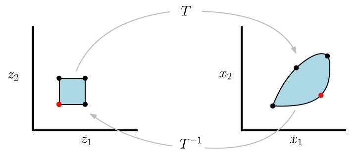
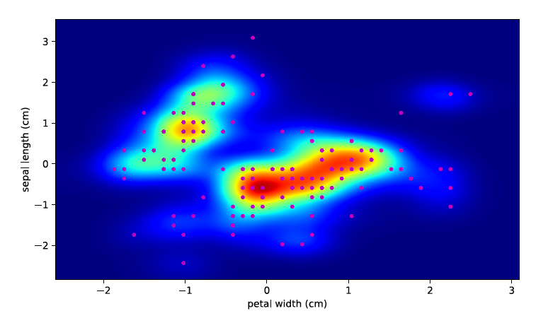
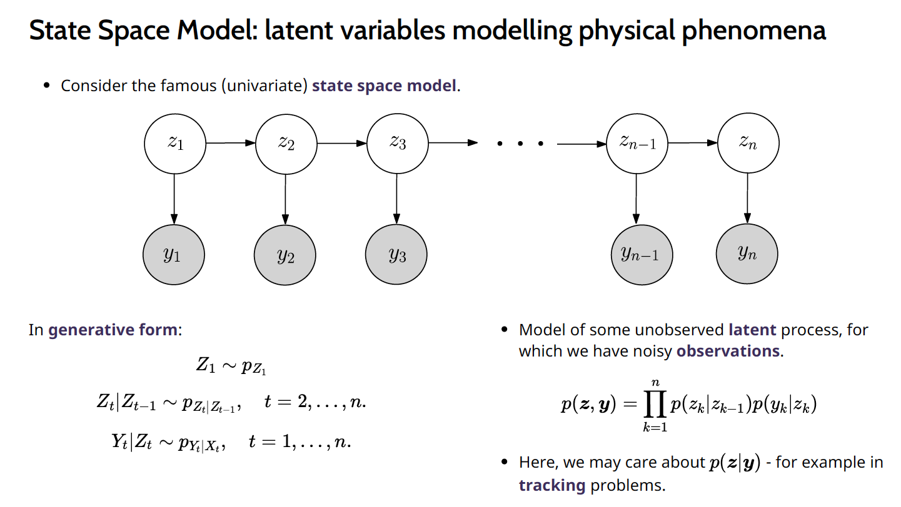
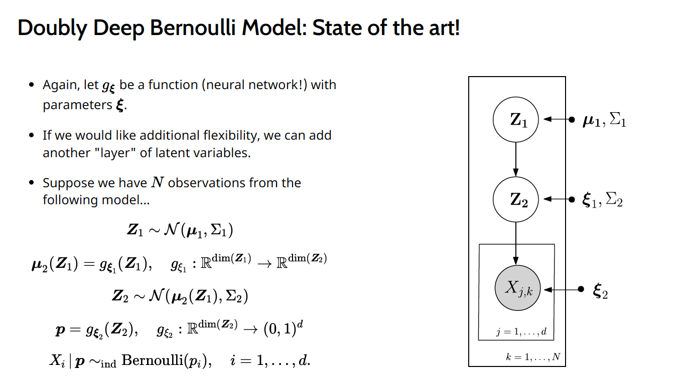

## AMSI Winter School, 2021 
Here are materials for a **Deep Probabilistic Models** mini course, which I developed and taught at the Australian Mathematical Sciences Institute (AMSI) Winter School in 2021. 
This is an annual Winter School attended by graduate students, early career researchers, and people from industry.

The content was quite well-received so I have made all the lecture slide and tutorial materials available for the general public who may also find them interesting. The material consists of approximately eight 50 minute lectures and two one-hour tutorials (practicals).  (with examples implemented in PyTorch and Pyro).

### Lecture Slides

**Lecture 1**: Flow-Based Models([Slides](/pdf/L1_Flows.pdf)) 

**Lecture 2**: Generative Adversarial Networks and Stochastic Backpropagation ([Slides](/pdf/L2_GAN.pdf)) 

**Lecture 3**: Graphical Models,  Deep Latent Variable Models, and Variational Learning ([Slides](/pdf/L3_VL.pdf)) 

**Lecture 4**: Amortized Variational Inference, Variational Autoencoders, and an Introduction to Pyro ([Slides](/pdf/L4_VAE.pdf)) 

## Tutorials (Jupyter Notebooks)

**Tutorial 1**: [Notebook](https://github.com/robsalomone/AMSIWinterSchool2021/blob/main/Tutorial1.ipynb) 

**Tutorial 2**: [Notebook](https://github.com/robsalomone/AMSIWinterSchool2021/blob/main/Tutorial2.ipynb) 

### Feedback

The material and delivery was very well recieved. Here are some replies from the attendees (in response to a question regarding highlights of the Winter School as a whole): 

> “I liked the presentations and the content by Robert Salomone as I found his explanation much better than the contents I have reviewed until now from the web source.”

> “My favourite speaker was Robert Salomone. Rob presented his take on deep latent variable models. He was masterful in linking together concepts between topics in his course"

> "“Rob Salomone, what a mix of maths, teaching, jokes, energy and attitude.”

> “Dr Robert Salomone is my favourite speaker because of his passionate, enthusiastic and encouraging teaching styles. I have never touched deep learning models before and which has been considered as one of top-trended but extremely difficult machine learning topics. His talks make lectures very interesting and easy to follow for someone like one. Really high quality!”

> “Rob Salomone was my favourite speaker because he had the best energy when presenting. He also provided astute mathematical and statistical insights into neural networks, and this is a topic that I was very interested to learn about. I also greatly enjoyed his tutorials, which were very practical."

> “Dr Robert Salomone is my favourite lecturer. His erudition and passion attracted me.”